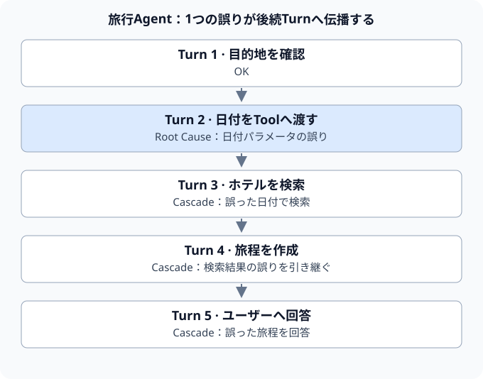
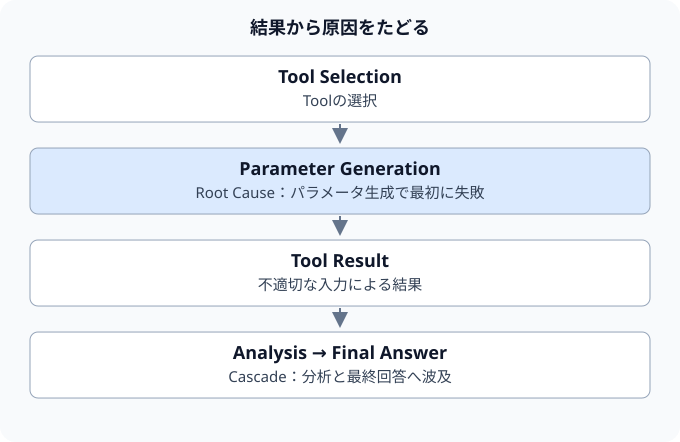
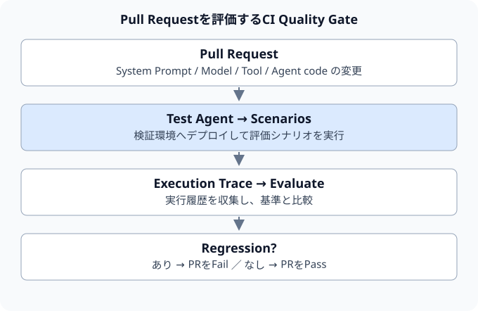
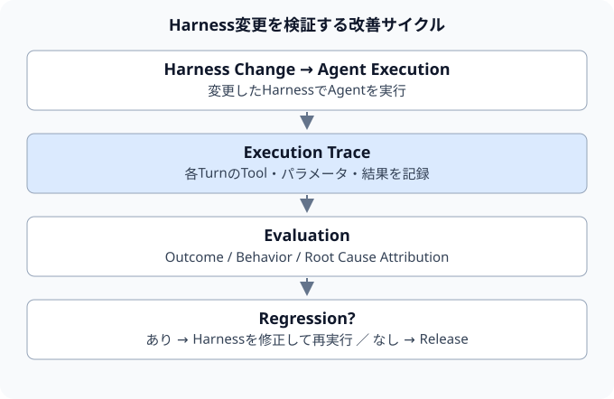

前編: [AI Agentの品質はモデルだけでは決まらない — Harness Engineeringとは何か](/2026/09/22/harness-engineering/)

AI Agentの性能評価において、一般的に用いられる基本指標はタスク成功率（Task Success Rate）である。

与えられたタスクに対して最終的な結果が成功したか失敗したかを二値（Pass / Fail）で判定する。

コーディングエージェントを例に取ると、以下のような最終成果物（Outcome）の成否を確認する。

- 指定されたIssueが正しく修正されたか
- テストスイートが全件パスしたか
- 要件を満たすPull Requestが作成されたか

この評価は、受入基準やマイルストーン達成度を測る上で不可欠である。
しかし、Agentが複数のツールを自律的に使い分け、長時間のマルチターン（Multi-turn）処理を実行する環境では、この「成功率」という粗い指標のみではシステムの改善に必要なインサイトが得られない。

たとえば、全5ターンの実行シーケンスにおいて後半の4ターンが失敗と記録されていた場合、このAgentに4つの独立した不具合が存在するとは限らない。

たとえば、ターン2でツール引数の指定を誤り、その前提を引き継いだターン3〜5が連鎖的に失敗した可能性がある。

このケースでは、まずターン2の誤りを調べたい。マルチターンAgentの品質改善には、**「何回失敗したか」に加えて「どこで最初に失敗し、どう波及したか」**を把握することが重要である。

## Agentの失敗は連鎖する

従来のソフトウェアでも、上流の障害が下流へ波及することはある。過去の実行履歴を参照するAgentでも、誤った情報を次の判断に使うと、同じように失敗が連鎖する。

旅行手配を行うエージェントを例に考える。



ターン2で日付パラメータの指定を誤った場合、その誤った前提に基づいてターン3のホテル検索が実行され、ターン4の旅程作成、ターン5のユーザー回答に至るまで、後続のすべての出力が不正となる。

結果のみを集計すると、以下のようになる。

| Turn | 結果 | 原因との関係 |
| --- | --- | --- |
| 1 | OK | 目的地は適正 |
| 2 | NG | 日付パラメータの指定誤り（Root Cause） |
| 3〜5 | NG | ターン2の誤作動による波及（Cascade） |

全5ターン中4ターンが失敗しているため、ターン単位の合格率は20%である。一方、旅行手配というタスク全体は失敗している。冒頭のタスク成功率とは、集計の単位が異なる。

しかし、これは独立した4件の障害ではなく、真の根本原因（Root Cause）はターン2の1件のみである。ターン3〜5の失敗は、先行エラーの波及による二次的なカスケード失敗（Cascade Failure）に過ぎない。

この例で最初に調べる対象はターン2である。依存関係を確認すれば、同じ原因による失敗を別々の不具合として調査する重複を減らせる。ただし、後続処理に検証や復旧を追加し、誤りの波及を抑える対策にも意味がある。

## AWSのAgent Evaluation Metric

AWSが発表したマルチターンAgent向けの評価指標「Agent Evaluation Metric（AEM）」は、このカスケード障害の構造を解き明かすために設計された枠組みである。

AEMでは、Agentの実行ログをターン単位で詳細に追跡し、単なる合否判定にとどまらず、失敗種別（Failure Type）を詳細に分類・記録する。

その前提になるのは、期待する応答やツール呼び出しを付与した正解データである。AWSの記事では、人間が作成またはレビューした正解と実際の出力を比較し、正確さと必要な情報の充足を評価している。ログを集めるだけで、自動的に正誤や原因が分かるわけではない。

ツール実行を伴うアクションターンにおいては、以下のようなFailure Typeが定義されている。

- `tool_mismatch`: 文脈に合致しない不適切なツールを選択した
- `action_mismatch`: 意図と異なるアクションを実行した
- `missing_parameters`: 必須パラメータが欠落している
- `extra_parameters`: 想定外のパラメータが渡された
- `inconsistent_parameter_values`: パラメータ値が意味的に誤っている

特に重要な設計が、`prior_action_failed` の分類である。
これは、当該ターンの推論やアクション自体の誤りではなく、**「先行ターンのアクション失敗に引きずられて二次的に発生した失敗である」**ことを明確に識別するフラグである。

AWSの記事にある出力例を抜粋すると、評価結果は次のように整理できる。これは説明用の例であり、固定のAPI仕様を示すものではない。

```json
{
  "first_failure_turn": 2,
  "root_cause": "inconsistent_parameter_values",
  "root_cause_count": 1,
  "cascading_count": 3
}
```

「ターン単位の合格率20%」だけでは、どこを調べるべきか分からない。「ターン2の誤りが後続の3ターンへ波及した」と分かれば、調査対象を絞り込める。

そこから、ターン2のプロンプトやツールスキーマなどを確認し、改修が必要かを判断する。

## Agent Evaluationを3つの層で考える

本稿では、Harness Engineeringとターン単位の評価をつなぐため、評価の役割を次の3層に整理する。

### 第1層：成果評価（Outcome Evaluation）

システム全体の最終的なアウトプットを検証する層である。

**最終的なユーザー要件やタスク目的を達成できたか。**

- 指定されたIssueの修正完了
- テストスイートの全件パス
- ユーザー要求を満たす正確な回答の出力
- 目標タスクの正常終了

End-to-Endのベンチマークやタスク成功率は主にこの層を測定する。システムの受入基準として必須であるが、失敗に至った内部要因を解明することはできない。

### 第2層：振る舞い評価（Behavioral Evaluation）

タスク実行の過程において、Agentが期待される規律や手順に従って行動したかを検証する層である。

- 状況に応じた適切なツールを選択したか
- 変更処理の直後に所定のバリデータを実行したか
- 認可外のコマンドや禁止操作を実行しなかったか
- 必須パラメータを正確に引き渡したか

これはHarness Engineeringと密接に連動する。Harnessやプロンプトの改修時に、従来の正常な振る舞いが維持されているか（リグレッションの有無）を検証し、Outcomeだけでは検知できないプロセスの劣化を捉える。

### 第3層：根本原因の特定（Root Cause Attribution）

マルチターン実行で、どの振る舞いから失敗が始まり、後続処理へどう波及したかを調べる層である。



実行ログを逆算的にトレースし、二次的なカスケード失敗と初発の根本原因を分離する。これにより、評価プロセスを単なる「異常検知（Failure Detection）」から「障害診断（Failure Diagnosis）」の領域へと進展させる。

ただし、最初に失敗したターンの特定と、実装上の根本原因の確定は同じではない。その前に渡された指示やコンテキストにも原因があり得るため、依存関係と再現テストで仮説を確かめる。

この3層構造を揃えることで、Agent Evaluationは単なるスコアリングツールから、ソフトウェアエンジニアリングにおける**実践的なデバッグ基盤**へと進化する。

## 「失敗率を下げる」だけでは改善できない

たとえば、Coding Agentのタスク成功率が **72%から78%へ改善**したとする。

表面上のスコアは向上しているが、どの要因によって向上したのかが定量的に特定できていなければ、改善の再現性は担保されない。

逆に、スコアが **78%から74%へ低下**した場合も同様である。原因の所在が不明であれば、有効な是正措置を講じることができない。

基盤モデルの変更が影響したのか、ツールスキーマの更新に伴いパラメータ生成精度が劣化したのか、あるいは必要なコンテキストが欠落していたのか。失敗の内訳が可視化されていなければ、適切な施策選定は困難である。

Agentを継続的に改善・運用するためには、**単一のスコアに依存せず、失敗の分布（Failure Distribution）を分析するアプローチ**が不可欠となる。

下表は説明用の架空の分布であり、実測値ではない。失敗したターンを1件ずつ分類し、その総数を分母としている。

| Failure Type | 割合 | 分析の観点 |
| --- | ---: | --- |
| `tool_mismatch` | 12% | ツール選定の不備 |
| `missing_parameters` | 8% | 必須パラメータの欠落 |
| `inconsistent_parameter_values` | 31% | パラメータ値の不整合 |
| `prior_action_failed` | 38% | 先行アクションの失敗からの波及 |
| `other` | 11% | その他の例外事象 |

`prior_action_failed` は失敗全体の38%を占めるが、この表だけでは、どの先行エラーから波及したかは分からない。31%のパラメータ不整合を直せば、その大部分が解消すると断定することもできない。

まず実行ごとのトレースを調べ、パラメータ不整合と連鎖失敗の依存関係を確認する。その影響範囲、利用者への影響、修正コストから優先順位を決め、修正後の再評価で効果を確かめる。

先行エラーの修正に加え、後続処理での入力検証や復旧も検討したい。二次的な失敗も利用者には影響するため、単なるノイズとして除外しないことが重要である。

## EvaluationにはExecution Traceが必要になる

前述のような詳細な評価を成立させるためには、Agentの最終出力のみを蓄積するログ運用では不十分である。

入力・出力、ツール呼び出しと結果、状態遷移、検証結果を、原因調査に必要な範囲で記録する。この観測可能な実行履歴が **Execution Trace（実行トレース）** であり、モデル内部の思考過程を網羅的に取得することは前提にしない。

引数や戻り値には個人情報や秘密情報が含まれ得る。記録対象を絞り、マスキングやアクセス制御、保存期間も設計する。

| 実行順 | Traceに記録すべき情報の例 |
| --- | --- |
| Turn 1 | ツール Aの呼び出し引数および実行結果 |
| Turn 2 | ツール Bの呼び出し引数および実行結果 |
| Turn 3 | ツール Cの呼び出し引数および実行結果 |
| Final Response | ユーザーへ提示した最終応答 |

Agent Observability（可観測性）とAgent Evaluation（評価）は、同じ実行トレースを異なる目的で使う。前者は何が起きたかを調べ、後者はその振る舞いが要件に照らして妥当だったかを判定する。

| 同じExecution Traceへの視点 | 評価の問い |
| --- | --- |
| Observability | 何が起きたか？ |
| Evaluation | その振る舞いは仕様として正しかったか？ |

Agent Evaluationを本格的に運用するにつれて、Observabilityは単なるインシデント監視ツールにとどまらず、**システムの品質保証と自動テストを支える基盤インフラ**として位置付けられるようになる。

## CIで回帰を検出する

根本原因の特定手法が確立されたとしても、管理者がダッシュボード上で定期的に確認するだけの手動運用では、コード改修に伴うリグレッションを未然に防ぐことは困難である。

したがって、この評価プロセスをCI/CDパイプラインへ自動統合する構成が不可欠となる。

AWSが提示するリファレンスアーキテクチャでは、Amazon Bedrock AgentCore EvaluationsとGitHub Actionsを連携させ、Agentの構成変更時に自動評価を実行する仕組みが示されている。

具体的には、以下の構成要素に対する変更を含むPull Requestが作成された際、CI上で自動評価を実行し、マージ可否を判定するQuality Gateを設ける。

- システムプロンプト
- 基盤モデル
- ツール定義および実装
- Agent制御コード



CIに評価を組み込むと、テストケースで検出できる品質低下をリリース前に見つけられる。ただし、未知の入力や評価の誤判定までは防ぎ切れないため、本番での監視も続ける。

これは、従来のソフトウェア開発においてユニットテストや統合テストが果たしてきた役割そのものである。

## Agent EvaluationはObservabilityとCIをつなぐ

これまでの議論を統合すると、Agentエンジニアリングの改善サイクルは下図のフィードバックループとして定義できる。



Agentの実行失敗を検知した際、Traceの解析を通じて根本原因（Root Cause）を特定する。その失敗パターンを再現する回帰テストを作成してHarnessを改修し、CI環境での自動テストによって再発を防止する。

このフィードバックループが継続的に運用されて初めて、Agent Evaluationは単発のベンチマーク測定を脱し、プロダクト品質を恒常的に向上させる実用的な開発プロセスとして機能する。

## Agent Evaluationを「採点」から「デバッグ」へ

AI Agentの評価においては、モデルごとのベンチマークスコアや総合正解率といったマクロな指標に注目が集まりやすい。

本番運用での改善には、スコアに加えて「なぜ失敗したか」を調べる必要がある。マルチターン実行では、最初の失敗箇所と後続処理への影響を分けて捉えたい。

成果と振る舞いを評価し、失敗の原因を調べる。見つかった事例を回帰テストへ取り込み、CIで変更の影響を確認する。この一連の作業をつなぐことで、評価結果を次の改修に生かせる。

ソフトウェアエンジニアリングにおいて真に実効性のあるテストとは、単に障害を検知してビルドを停止させるだけでなく、**どこに根本的な不具合が存在するかを開発者に的確に示す診断能力**を備えたものである。

Agent Evaluationも同様の方向へと進化している。
Agentを業務システムの一部として扱う以上、評価の主眼は見栄えの良いスコアの獲得ではない。

目指したいのは、実行履歴から原因を調べ、回帰テストで同種の失敗を検出しやすくして、再発リスクを下げることである。

ベンチマークによる比較、テストによる検証、デバッグによる原因調査は、それぞれ役割が異なる。Agent Evaluationをスコアの集計だけで終わらせず、この3つをつなぐ開発プロセスとして活用したい。

## 参考

- [AWS — Agent Evaluation Metric for multi-turn conversations](https://aws.amazon.com/blogs/machine-learning/agent-evaluation-metric-for-multi-turn-conversations/)
- [AWS — Automated agent evaluation with Amazon Bedrock AgentCore and GitHub Actions](https://aws.amazon.com/blogs/machine-learning/automated-agent-evaluation-with-amazon-bedrock-agentcore-and-github-actions/)
- [Google Developers Blog — The Anatomy of Harness Engineering: How to Evaluate, Iterate, and Guard AI Coding Agents](https://developers.googleblog.com/the-anatomy-of-harness-engineering-how-to-evaluate-iterate-and-guard-ai-coding-agents/)
