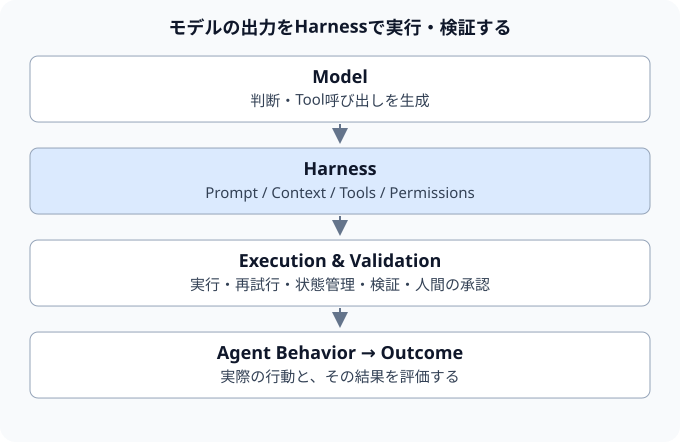
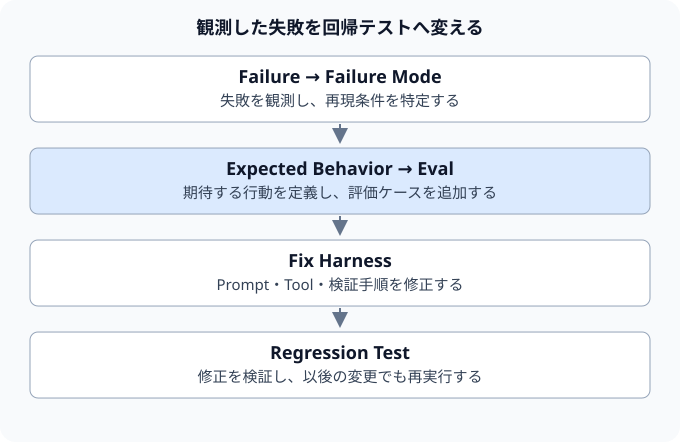

AI Agentの性能評価において、従来は基盤モデルの能力やベンチマークスコアの向上が注目されがちであった。

新しいフロンティアモデルが登場するたびに、コーディングエージェントの処理能力がどれほど向上したか、公開ベンチマークのスコアがどれだけ伸びたかが議論の中心となる。

もちろん、基盤モデル自体の推論能力は極めて重要である。しかし、Claude CodeやCodexをはじめとする自律型エージェントの実務運用においては、Agentの実用品質はモデル単体の性能だけで決まるわけではない。

同一のモデルを採用した場合であっても、以下の設計要素によってAgentの挙動や実行信頼性は大きく左右される。

- システムプロンプトの構成
- 提供するツールの定義とインターフェース
- 注入するコンテキストの選別・構造化
- 実行途中でのValidation（検証）のタイミングと基準
- 自律実行の許容範囲と権限管理
- 人間の介入（Human Approval）を要求するトリガー条件

すなわち、AI Agentを本番環境で安定稼働させるには、モデル単体にとどまらず、**モデルを取り巻く実行環境全体を独立したソフトウェアシステムとして設計・検証（エンジニアリング）する視点**が不可欠となる。

Google Developers Blogで紹介されている「Harness Engineering」は、この実行環境を設計・評価・改善するための考え方である。

## Harnessとは何か

Harness（ハーネス）とは、基盤モデルを安全かつ意図通りに自律動作させるための、周辺の制御機構やインターフェース群の総称である。

コーディングエージェントを例に取ると、主に以下のコンポーネントで構成される。

- システムプロンプト
- コンテキスト供給機構
- ツール定義および実行環境
- 短期・長期メモリ管理
- Execution Loop（自律実行制御ループ）
- Permission（権限管理）
- エラーハンドリングおよびRetry機構
- Validation（結果検証機構）
- Human Approval（人間の承認フロー）

単純化すると、次のようなアーキテクチャとして整理できる。

この構成を踏まえると、Agentの運用課題をすべて「モデルの性能不足」に帰するべきではない。

たとえば、Agentがソースコードを変更したにもかかわらず、テストを実行せずにタスクを終了してしまったケースを考える。
モデルの推論能力だけでなく、以下のようなHarness側の設計不備も原因として考えられる。

- システムプロンプトでテスト実行の義務付けを指示していなかった
- テスト実行用ツールのインターフェースや実行権限が適切に提供されていなかった
- ファイル変更後にテスト実行を強制するValidationステップがHarness側に組み込まれていなかった

したがって、Agentの実用品質を継続的に改善・担保するためには、モデル自体の評価（Model Evaluation）に加えて、**Harness全体の挙動を検証する評価（Harness Evaluation）**の確立が不可欠となる。

## Outcomeだけを見てもHarnessは改善できない

コーディングエージェントにIssueを割り当て、最終的にテストをパスするコードが生成されたかを確認する手法は、成果物に対する評価（Outcome Evaluation）として重要である。

しかし、最終結果の合否（Pass / Fail）のみを観測していると、Agentがタスクを解決する過程でどのようなプロセスを踏んだのかを把握できない。

たとえば、同じ「タスク完了」と判定される結果であっても、プロセスの妥当性には明確な差異が存在する。

| 段階 | 検証を伴うプロセス | 検証を省略したプロセス |
| --- | --- | --- |
| 要件把握 | 要件を論理的に理解する | 要件を推測で補完する |
| 調査・実装 | コードベースを調査した上で修正する | 調査を行わず直接修正する |
| 検証 | テストを実行して妥当性を確認する | テストを実行せず終了する |
| 結果 | テストの範囲で妥当性を確認済み | Agent自身による検証がないまま完了 |

外部の評価で最終成果物が合格すれば、どちらも「成功」と集計され得る。ただし、後者にはAgent自身が変更を検証した記録がない。未検証だから偶然の成功とは断定できないが、想定する検証手順が守られたかは別途確認する必要がある。

そのため、最終成果（Outcome）のみならず、実行過程におけるプロセスの健全性を検証する**Behavioral Evaluation（振る舞い評価）**の導入が求められる。

## Agentの振る舞いをテストする

Harness Engineeringにおける重要なアプローチの一つが、Agentが実行途中に取った行動（Behavior）そのものをテスト対象とすることである。

具体的には、以下のような振る舞いを検証する。

- 指示が曖昧な場合に、独断で進めずユーザーへ確認を求めたか
- ビルド設定や設定ファイルの変更後に、指定されたバリデータを実行したか
- タスク達成に必要なツールを過不足なく選択・実行したか
- 推測に頼らず、信頼できる一次情報源（ドキュメントやコードベース）を参照したか

モデルとツール、実行環境の組み合わせを確認する点では、ソフトウェアの結合テストにも近い。

たとえば、「コードを変更した場合は必ずテストを実行する」という運用ルールを定義した場合、システムプロンプトへの記述だけではモデルが常にその方針を遵守する保証はない。

そこで、BDD（振る舞い駆動開発）の手法に倣い、以下のような評価シナリオを定義する。

| 条件 | 評価シナリオ |
| --- | --- |
| Given（前提条件） | コード変更が必要なタスクを入力する |
| When（実行） | Agentがタスクを実行する |
| Then（期待結果） | コード変更後に対象のテストが実行され、Agentが完了結果を確認している |

ツールの呼び出しが記録されているだけでは、実行エラーや変更前のテストを見逃す。変更後のコードに対する実行と、その完了結果まで確認する。タスク完了にテストの合格を求める場合は、成果評価の条件として別途定義する。

このようなBehavioral Evalをあらかじめ構築しておくことで、プロンプトやツール定義に変更を加えた際にも、**「過去に担保されていた期待される振る舞いが損なわれていないか（リグレッションが発生していないか）」**を定量的に検証可能となる。

## Agentの失敗を回帰テストへ変える

Harness Engineeringの実践において特筆すべき点は、初期段階から網羅的で巨大な評価スイートを設計する必要はないという点である。

まず実務環境でAgentを運用し、発生した失敗事例を観察・収集することから開始する。
たとえば、「ビルド設定を変更したにもかかわらず、バリデータを実行せずにタスクを完了した」という失敗が確認された場合、その事象をそのまま1つのBehavioral Evalとして定義・登録する。

このアプローチは、ソフトウェア開発における一般的なバグ修正サイクルと同様である。不具合が発見された際には原因を特定して再現テストコードを作成し、修正を適用した上で、再発防止のためにそのテストをCIパイプラインへ恒久的に組み込む。

Agent開発においても、**「観測された失敗事例を再現可能な回帰テスト（Regression Test）として蓄積する」**運用プロセスを定着させることが、システム全体の品質向上につながる。

## ただし振る舞いを固定しすぎてはいけない

一方で、振る舞い評価を過度に厳格化することには留意が必要である。Agentは従来のプログラムとは異なり、非決定論的（Non-deterministic）に動作するためである。

たとえば同じ課題でも、`A → B → C` と `A → D → C` のどちらのツール実行順序も妥当な場合がある。評価では、唯一の実行順序を強制しないことが重要である。

ここで「必ずツール A → ツール B → ツール Cの順序で実行すること」といった過度に制約の強いアサーションを設けると、Agentが持つ柔軟な探索能力や最適化の余地を阻害してしまう。

したがって、**「決定論的（Deterministic）に評価すべき項目」と「確率的（Probabilistic）に評価すべき項目」を論理的に切り分ける設計**が必要となる。

**決定論的（Deterministic）なルールベース検証が適する項目:**

- 禁止コマンドや非認可ツールの実行要求が拒否されること
- 必須バリデータやテストの実行有無
- APIパラメータの必須項目の充足
- 対象外ファイルへの書き込み要求が拒否されること
- ビルドおよびテストの最終的な合否

**確率的（Probabilistic）な定性評価（LLM-as-a-Judge等）が適する項目:**

- 調査戦略および探索プロセスの合理性
- ユーザー向け回答の明瞭性と過不足のなさ
- 複数の解法が存在する場合における選択の妥当性

ここでは、実行時の制御と評価を区別したい。禁止操作は権限チェックなどで実行前に拒否し、評価ではその制御が機能することを確認する。事後評価だけで禁止操作を防げるわけではない。

回答の明瞭さなど、ルールだけでは判定しにくい項目には、LLMを評価者として使うLLM-as-a-Judgeも選択肢になる。ただし、その判定にも誤りがあるため、人間の評価との比較や判定基準の調整が必要である。

## Harness EngineeringはAgentをソフトウェアとして扱うための考え方

Harness Engineeringは、単に新しいフレームワークやライブラリの導入を指すものではない。その本質は、**AI Agentを堅牢なソフトウェアシステムとして統制・運用するためのエンジニアリング規律**にある。

モデルのバージョンアップ、Promptの調整、ツールの追加や仕様改修、コンテキスト注入ルールの変更、実行権限の見直しなど、Harnessに対するあらゆる変更はAgentの出力挙動に影響を及ぼす。

Agent Harnessも、一般的なソフトウェアと同様に、変更によって以前の正常な動作が損なわれる可能性がある。だからこそ、変更のたびに自動テストを実行し、遭遇した失敗を回帰テストへ取り込む。CI（継続的インテグレーション）でこの確認を続けることが重要である。

こうした取り組みが、AI AgentをPoC（概念実証）から本番運用へ進める際の品質確認を支える。

## Agentの品質は「どのモデルを使うか」だけでは決まらない

Agentの選定や導入にあたっては、基礎モデルの優劣に議論が集中しやすい。

しかし、実際の業務運用における品質は以下の関係性で捉えるべきである。

**Agent Quality ≠ Model Quality（Agentの品質 ＝ モデルの品質ではない）**

実務的な観点からは、次のような相乗効果の構造として捉えることが適切である。

**Agent Quality ≈ Model × Harness × Evaluation × Operations**

※各要素が相互に依存し、いずれか一角の不備がシステム全体の信頼性を損なうことを示す概念モデルである。

どれほど推論能力の高い最先端モデルを採用しても、権限設計やガードレールのないHarness環境下ではセキュリティおよび運用上のリスクが高く、本番稼働は困難である。
逆に、モデルの推論特性に応じたValidationや適切なコンテキスト供給をHarness側で実装することで、実用要件を安定して満たすことが可能となる。そしてそのHarnessの健全性を担保し続けるために、客観的な評価（Evaluation）の仕組みが欠かせない。

Harness Engineeringの意義は、**AI Agentを不確定要素の多いブラックボックスとして扱うのではなく、テスト可能で再現性のあるソフトウェアシステムとして統制・運用可能にする点**にある。

次稿では、この設計論を一歩進め、マルチターン対話におけるAgentの挙動評価と障害原因の特定（デバッグ）に焦点を当てて論じる。

マルチターン実行では、初期ターンの誤りが後続処理に連鎖することがある。その場合、失敗数の集計だけでは改修箇所を絞り込めない。次稿では、評価結果を原因調査に活用する方法を考える。

次稿: [AI Agentの評価を「スコアリング」から「デバッグ」へ — どこで最初に壊れたかを評価する](/2026/09/22/agent-evaluation-debugging/)

## 参考

- [Google Developers Blog — The Anatomy of Harness Engineering: How to Evaluate, Iterate, and Guard AI Coding Agents](https://developers.googleblog.com/the-anatomy-of-harness-engineering-how-to-evaluate-iterate-and-guard-ai-coding-agents/)
