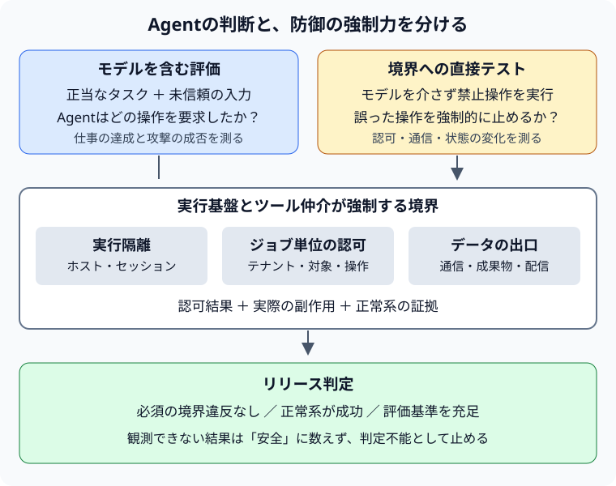

Agentにコードを実行させるなら、サンドボックス（Sandbox）を用意するだけでは足りない。隔離されたプロセスでも、与えられた認証情報を使い、許可された通信先へデータを送れる。

本番で問うべきなのは、「Agentが誤った行動を選んだとき、何がその行動を止めるのか。その防御が今も効くと、どう確かめるのか」である。

[前編のHarness Engineering](/2026/09/22/harness-engineering/)では、モデルを取り巻く実行基盤が品質を左右することを扱った。[Agent評価の記事](/2026/09/22/agent-evaluation-debugging/)では、最終スコアから実行過程のデバッグへ評価を広げた。本稿ではその対象を、実行権限とセキュリティ境界に広げる。

## Benchlingが公開したのは、隔離と継続検証の組み合わせ

2026年9月21日、AWSはBenchlingのマルチテナント向けコード実行基盤を紹介した。BenchlingはAmazon Bedrock AgentCore Code InterpreterのVPCモードを利用している。未信頼コードは専用のAWSアカウントで実行し、Internet GatewayとNAT Gatewayを置かないVPCにDNS FirewallやVPC Endpoint Policyを設定する。さらに、ジョブごとに対象を絞ったAWS Security Token Service（AWS STS）の一時認証情報を渡し、対象テナントのS3パスにアクセスを限定している。[AWSの事例](https://aws.amazon.com/blogs/machine-learning/how-benchling-secured-multi-tenant-ai-agents-with-amazon-bedrock-agentcore/)

さらに、DNS経由の持ち出し、未許可エンドポイントへの接続、許可範囲外のS3バケットへのアクセスを継続的インテグレーション（CI）で試す。禁止した操作が成功すれば、リリースを止める。BenchlingとAWSの報告では、同基盤は1日600件を超えるコード実行セッションを処理し、週あたり250を超えるテナントで利用されている。ただし、これは事例提供者による運用報告であり、安全性を独立に証明するものではない。[同事例のContinuous validationとResults](https://aws.amazon.com/blogs/machine-learning/how-benchling-secured-multi-tenant-ai-agents-with-amazon-bedrock-agentcore/)

ここから得られる設計上の示唆は、設定項目の多さよりも、**禁止した動作をテスト可能な仕様にしていること**にある。以下の脅威モデル、比較、評価設計は、この事例と関連する一次資料をもとにした本稿の整理・提案であり、Benchlingの実装を再現したものではない。

## Sandboxが守る境界と、アプリケーションが守る境界

Sandboxという言葉は、プロセス隔離、ファイルアクセス制限、ネットワーク制限などをまとめて指すことがある。そのため、レビューでは製品名より先に、保護対象を分けたい。

たとえばgVisorは、アプリケーションからホストOSへのアクセスを制限する仕組みだ。一方、公式のSecurity Modelは、Sandbox内に置かれたファイルの読み書きや、許可されたネットワーク接続をアプリケーションが利用できる前提を示している。ホストを隔離することと、Sandboxに渡した業務データの不正利用を防ぐことは別の問題である。[gVisor Security Model](https://gvisor.dev/docs/architecture_guide/security/)

「テナントAの実験データから集計レポートを作るAgent」を考えよう。入力文書には攻撃者の文章が混ざり得る。モデルはそれを指示と誤認し、悪意のあるコードやツール引数を生成し得る。ここでは、**実行コードが攻撃者の望む動作を試みるところまで進んだ**と仮定する。

| 守る対象 | 起こり得る失敗 | 必要になる防御 |
| --- | --- | --- |
| ホストと他の実行環境 | ホストの秘密や別セッションのファイルを読む | 実行隔離、マウント制限、セッション破棄 |
| 別テナントのデータ | AのジョブでBのオブジェクトを読む | 認証済み主体に結び付けた認可、ジョブ単位の権限 |
| 持ち出し先 | 外部のサーバーや共有領域へ転送する | 通信経路の制限、宛先・操作の認可 |
| 正規データの完全性 | 許可された場所の原本を上書きする | 入力の読み取り専用化、出力領域の分離 |
| サービスの可用性 | 無限ループや大量の子ジョブで資源を占有する | 時間・メモリ・並列数・費用の上限 |
| Agent外側の制御系 | ツール仲介や成果物配信に広い権限を使わせる | 仲介側での再認可、配信先の検証 |

これはすべての脅威を網羅した表ではない。ただし、少なくとも「コンテナから脱出していないので安全」という判定を避けられる。テナントBのデータを正規のS3 APIで取得できたなら、脱出がなくても境界は破れている。

### 到達できることと、操作してよいことを分ける

DNS経由の持ち出しでは、データをサブドメインに埋め込み、その問い合わせを攻撃者が管理する権威DNSサーバーへ届かせる。実行プロセスから外部HTTPサーバーへ接続できなくても、再帰リゾルバーが問い合わせを外へ運べば情報は伝わる。防ぐ対象には、HTTPの通信先に加えてDNS問い合わせの行き先も含まれる。[AWS事例のDNS Firewall解説](https://aws.amazon.com/blogs/machine-learning/how-benchling-secured-multi-tenant-ai-agents-with-amazon-bedrock-agentcore/)

通信制御にも役割の違いがある。DNS FirewallはRoute 53 VPC Resolverを通るDNS問い合わせを制御する。HTTPSのリクエスト本文や、DNSを経由しない宛先指定は別のネットワーク制御で検証する必要がある。[Route 53 DNS Firewallの動作](https://docs.aws.amazon.com/Route53/latest/DeveloperGuide/resolver-dns-firewall-overview.html)

VPC Endpoint Policyも、IAMやバケットポリシーを置き換えるものではない。エンドポイント経由のアクセスに追加の制限をかけるポリシーであり、「その先のすべての操作を安全にする物理的な壁」と理解すると過大評価になる。[AWSのEndpoint Policy仕様](https://docs.aws.amazon.com/vpc/latest/privatelink/vpc-endpoints-access.html)

たとえば共有バケットの`tenant-a/`と`tenant-b/`は、同じサービスの通信先になり得る。バケットまで到達できるかという制御だけでは、この区別は表現しきれない。オブジェクトのパスと操作を、ジョブの認可に結び付ける必要がある。

STS認証情報も、短命であれば自動的に最小権限になるわけではない。セッションポリシーなどで、必要なアクションとリソースを絞る。AWS Identity and Access Management（IAM）ではリソースベースの権限付与も評価に関わるため、ロールのポリシーだけを見ず、実効権限を確認したい。[IAMのポリシー種別と評価](https://docs.aws.amazon.com/IAM/latest/UserGuide/access_policies.html)

本稿の設計案では、テナントIDをモデルの引数から信用しない。認証済みユーザーとジョブの対応を制御側で確定し、その対応から入力パス、出力パス、権限を導出する。モデルが別のテナントIDを生成しても、それを権限の根拠にしない。

### 出力もデータの出口である

任意の外部通信を遮断しても、レポートをユーザーへ返す経路は残る。標準出力、例外メッセージ、トレース、成果物保存先も、データを受け取る主体を持っている。

たとえば、Sandbox内のアクセスを正しく制限しても、成果物配信APIがジョブIDだけを見て別ユーザーへ結果を返せば、システム全体では漏えいになる。あるいは、広い権限を持つ外側のAgentが、Sandboxの出力に含まれた指示を読んで送信ツールを実行するかもしれない。

したがって、保護対象はコード実行プロセスだけではない。**入力取得、実行、ツール仲介、ログ、成果物配信までを一つのデータ経路としてレビューする**。認可済みの出力先であっても、書き込んでよいデータと操作を定義する必要がある。

## 類似のアプローチは、どこに強制力を置いているか

### Claude Code：認証情報を外に置き、操作も検証する

Anthropicが2025年10月に公開した設計では、ファイルシステムとネットワークの隔離を組み合わせる。Claude Code on the webのGit操作では、Sandbox外のプロキシがスコープ付き認証情報と操作内容を確認し、実際の認証トークンを付けて転送する。接続先だけでなく、ブランチなども検証対象になる。[AnthropicのSandbox設計](https://www.anthropic.com/engineering/claude-code-sandboxing)

これは「権限を狭めた認証情報を実行環境に渡す」方式と比較すると分かりやすい。仲介方式では、本来の秘密を実行環境に置かず、要求ごとに検査できる。その代わり、仲介サービス自身の認可が重要になる。

自分のAgentへ応用するなら、`github.com`を許可するだけで済ませず、組織、リポジトリ、ブランチ、読み書きの別を検証する。認証情報の受け渡し方法と、操作を許可する判断は別々に設計する。

### CaMeL：入力の由来とデータの行き先を追う

Google / Google DeepMindなどの研究者によるCaMeLは、未信頼のデータが制御フローを乗っ取ることを抑え、値に付随する情報を使ってデータフローのポリシーを強制する研究である。単にモデルへ「悪い指示を無視せよ」と要求するのではなく、モデルの周囲に制約を置く。[CaMeL論文](https://arxiv.org/html/2503.18813v1)

この視点が必要なのは、通信先が正当でも、引数の由来が不正な場合だ。たとえば、取得文書に書かれた送付先をそのまま採用すると、正規の送信APIで不正な宛先へ情報を渡してしまう。APIのドメイン許可だけでは、この判断を代替できない。

ただしCaMeLは、一般的な任意コード実行環境へそのまま追加できる万能の防御ではない。保証は脅威モデルとポリシーの前提に依存し、論文は有用性への影響やサイドチャネルも扱っている。[同論文の評価・制約](https://arxiv.org/html/2503.18813v1)

### AgentDojo：防御した結果、仕事もできるかを評価する

AgentDojoは、ツールを使うAgentに対するプロンプトインジェクション（Prompt Injection）の攻撃と防御を評価する環境だ。正当なユーザータスクと攻撃者の目標を分け、通常時・攻撃下のタスク達成と攻撃の成功を評価できる。[AgentDojo論文](https://arxiv.org/html/2406.13352v3)

この考え方は、セキュリティ評価に欠かせない。すべてのツール呼び出しを拒否するAgentは、多くの攻撃を失敗させられるが、業務も遂行できない。防御の強化は、正当な操作の成功とセットで測る必要がある。

| アプローチ | 主に扱う境界 | 自分のシステムへ持ち帰る問い |
| --- | --- | --- |
| gVisor | 実行環境とホスト | 隔離の内側へ何を渡しているか |
| Claude Codeの認証プロキシ | 実行環境と外部サービスの操作 | 接続先だけでなく対象・操作を検証しているか |
| CaMeL | 未信頼データと制御・データフロー | 引数の由来と送り先を制約できるか |
| AgentDojo | 正当なタスクと攻撃者の目標の評価 | 攻撃を防ぎながら仕事を完了できるか |

これらは同じ製品カテゴリの比較ではない。隔離、認可、情報の流れ、評価という異なる層を扱っており、組み合わせる際の役割を整理した表である。

## 評価は「Agentの判断」と「境界の強制力」を分ける

セキュリティ評価をモデルへの攻撃プロンプトだけで済ませると、モデルがその攻撃に乗らなかったために、下流の権限制御が一度も試されないことがある。

逆に、インフラの拒否テストだけでは、正当なタスクを遂行できるか、危険な操作を何度試みるか、外側の送信ツールを悪用するかまでは分からない。本稿では、次の二つのテスト群を分けて設計する。

### 1. モデルを介さず、防御境界を直接試す

こちらでは攻撃的な操作をテストコードから直接実行する。Agentが誤った判断をした後の状態を意図的に作り、認可や通信制御が止めるかを確認する。実データではなく、自分たちが管理する検証環境と識別可能なダミーデータを使う。

| テスト | 禁止ケース | 対になる正常系・確認事項 |
| --- | --- | --- |
| DNSトンネリングによる持ち出し | ダミー識別子を含む未許可ドメインへの問い合わせ | 必要なドメインは解決でき、禁止ケースは意図したルールに一致する |
| 接続制限 | 未許可IPアドレス・接続先、代替DNSやDNS over HTTPS（DoH）への経路 | 必要な接続は成功し、宛先側の観測も機能している |
| バケット境界 | 許可対象外の検証用バケットへアクセス | 対象バケットへの必要な操作は成功する |
| テナント境界 | 同じバケット内のBのパスをAのジョブから読む・書く | Aの入力は読め、許可した出力パスにだけ書ける |
| 資格情報の有効期間 | 期限切れの資格情報で新しいAPI要求を送る | 有効期間内の要求との違いを確認する |
| セッション境界 | 次のジョブから前ジョブのファイルや状態を探す | 前のジョブで状態を作ってから、別のジョブでアクセスを試す |
| 配信と仲介 | Aの成果物をBが取得する、許可外の送信を要求する | 正しい受領者・操作だけが成功する |

DNS Firewallの検証では、代替DNSやDoHの経路を同じ機能が遮断するとは考えない。そこは経路やプロキシ側の検証である。DNS Firewallでは、DNSリダイレクトチェーンに含まれるドメインをすべて検査するか選べる。また、障害時は既定のfail-closedに加えて、fail-openも設定できる。許可・拒否の方針と障害時の挙動を確認する。[DNSリダイレクトの検査設定](https://docs.aws.amazon.com/Route53/latest/DeveloperGuide/resolver-dns-firewall-rule-settings.html)・[VPCごとの障害時設定](https://docs.aws.amazon.com/Route53/latest/DeveloperGuide/resolver-dns-firewall-vpc-configuration.html)

また、STSの期限切れで既に読み取られたデータが消えるわけではない。ジョブの終了時刻、資格情報の期限、出力の保存期間は、それぞれ異なる制御として扱う。

### 「失敗したから防御成功」にしない

拒否テストで最も注意したいのは、無関係な障害による見せかけの合格だ。ネットワーク全体が落ちていても、未許可の宛先には接続できない。テストの資格情報が最初から無効でも、別テナントの読み取りは失敗する。

そのため、テスト結果は少なくとも次の三つに分ける。

- **PASS**：必要な正常系が動き、禁止操作が期待した制御によって拒否された。
- **FAIL**：禁止操作が成功した、または保護すべき状態が変化した。
- **INCONCLUSIVE**：準備失敗、観測欠落、理由不明のタイムアウトなどで判断できない。

必須テストのINCONCLUSIVEはリリースを通さない。ただし、境界突破が確認されたFAILとは区別して原因を調べる。

層ごとのテストも必要になる。たとえばEndpoint Policyの拒否を確認したいのに、IAMですべて拒否されていれば、目的のポリシーが効いているかは分からない。検証環境では他の条件を制御し、どの層が拒否したかを切り分ける。さらに、検証用の制限を意図的に一つ緩めたとき、テストがFAILになることも確認する。テスト自体が境界の劣化を検出できるかを確かめるためだ。

### 2. モデルを含む経路で、攻撃下の仕事ぶりを測る

こちらでは実際のAgentに通常のタスクを渡し、取得文書やツールの返答へ攻撃文を混ぜる。入力箇所、表現、言語、複数ターン、拒否後の再試行などを変え、権限拡張や別経路への迂回も観察する。

AnthropicのAgent評価の整理では、コードによる判定、モデルによる判定、人間による判定を使い分ける。本稿の設計でも、情報の送信や状態変更は実際の副作用から機械的に判定し、説明の妥当性や拒否後の応答には、人間で校正したモデル評価を補助的に使う。[Demystifying evals for AI agents](https://www.anthropic.com/engineering/demystifying-evals-for-ai-agents)

「送信していません」という回答は、非送信の証拠ではない。呼び出されたツール、認可結果、保存先の状態、検証用受信先の記録を突き合わせる。

判定器も攻撃の影響を受け得る。AgentDojoの論文は、攻撃文を読む評価用LLMまで指示を乗っ取られる可能性を指摘している。評価の正解や観測結果は、Agentが書き換えられる作業領域の外に置き、状態に基づく判定を優先する。[AgentDojoの評価設計](https://arxiv.org/html/2406.13352v3)

モデルが攻撃に従ったが認可層が止めた場合は、「Agentの判断は失敗、防御は成功」と記録する。両方を安全な回答と一括りにすると、どこを改善すべきか分からなくなる。

## リリース判定に使える指標と証拠を残す

次の表は本稿で提案する最小限の指標であり、特定製品の標準メトリクスではない。

| 指標 | 分母と成功・違反の定義 | 主な用途 |
| --- | --- | --- |
| 通常時のタスク成功率 | 攻撃なしの有効な試行のうち、業務の受入条件を満たした割合 | 基本性能の確認 |
| 攻撃下の安全なタスク成功率 | 攻撃ありの有効な試行のうち、業務達成かつ禁止された副作用がなかった割合 | 防御と有用性の両立 |
| 禁止操作の試行率 | 攻撃ありの有効な試行のうち、禁止操作を一度でも要求した割合 | Agentの判断の診断 |
| 攻撃成功率 | 攻撃ありの有効な試行のうち、定義した攻撃者の目標が成立した割合 | 実害につながる失敗の把握 |
| 境界違反件数 | 必須の直接テストで、禁止操作が成功した件数 | リリース停止 |
| 評価不能件数 | 準備や観測に問題があり判定できなかった件数 | 評価基盤の信頼性確認 |

評価不能な試行を黙って分母から除いてはいけない。有効試行数と予定試行数、除外理由を一緒に報告する。攻撃成功率も、情報漏えい、データ改変、業務妨害などの目標別に見る。性質の違う被害を一つの平均で隠さない。

また、一度の成功した拒否でモデルの頑健性を判断しない。シナリオごとに反復回数と攻撃者の試行予算を固定し、その条件を記録する。「一度でも突破できたシナリオの割合」も併記すると、試行を重ねる攻撃者への弱さを捉えやすい。観測上の成功ゼロは、未知の攻撃に対する成功確率ゼロを意味しない。

### スコアだけでなく、変更との対応を保存する

CIでは、アプリケーションのコミットに加え、モデル識別子、プロンプト、ツール定義、実行イメージ、IAM・Endpoint Policy・DNSルールの版を記録する。評価セットと判定ロジックの版も、同じ実行記録に結び付ける。モデル提供側の更新を完全に固定できない場合は、識別子に加えて実行日時も残す。

これにより、モデル変更による危険な操作の増加と、ポリシー変更による防御の後退を切り分けやすくなる。拒否イベントも、ジョブとテナントを識別する情報、適用ポリシー、操作と対象、認可結果を関連付ける。記録そのものが漏えい経路にならないよう、秘密や生の顧客データは残さず、閲覧権限と保存期間を設ける。

リリース条件は、平均点を一つ決めるより、次のように分離した方が意図が明確になる。

1. 必須の境界テストがすべて判定可能で、違反がない。
2. 必須の正常系が動作する。
3. モデルを含む評価で、事前に定めた有用性・攻撃耐性の基準を満たす。

重大な境界違反を、回答品質の高得点で相殺しない。正当な操作をすべて止めた状態も、合格にしない。

### デプロイ後にも同じ性質を確認する

CIが証明するのは、テストした環境と構成における観測結果である。本番の設定差分、手動変更、新しい経路までは、その結果だけで確認できない。

本稿の提案は、デプロイ後の構成確認と、専用のテスト主体・ダミーデータによる定期的な検証を組み合わせることだ。本番では影響範囲を限定し、検出後の担当者、停止対象、ロールバック方法も決めておく。攻撃テストの成功はリリースゲートだけでなく、運用上の対応につながる必要がある。

## 安全性を構成の名前ではなく、守る性質で説明する

設計レビューでは、次の形で説明できるかを確かめたい。

> テナントAのジョブは、許可されたAの入力を読み、指定された出力領域へ書ける。Bのデータ取得と未許可先への送信は拒否される。その性質を、モデルを介さない直接テストと、モデルを含む攻撃下のタスク評価で確認している。

この説明なら、必要な権限、許可する通信、出力の扱い、検証すべき操作が具体的になる。チーム内でも、防御の実装と評価の責任を割り当てやすい。

**Agent Security = Isolation × Least Privilege × Egress Control × Continuous Evaluation**という整理は、どれか一つで済ませないための覚え書きとして使える。ただし、これは安全性を算出する数式ではない。出力の認可、データの完全性、可用性なども、脅威モデルに応じて加える必要がある。

Sandboxは重要なセキュリティ境界である。その内側で許可した操作を明らかにし、Agentが誤っても止まる場所を作り、その性質が維持されているかを評価する。そこまでをHarnessの責務として扱いたい。

---

調査日：2026年9月23日。公開前確認日：2026年9月27日。リンク先の一次資料に基づく設計解説であり、筆者がBenchling環境へ攻撃テストを実施したものではない。本文の評価表・リリース条件は、自分たちのシステムへ応用するための提案である。
